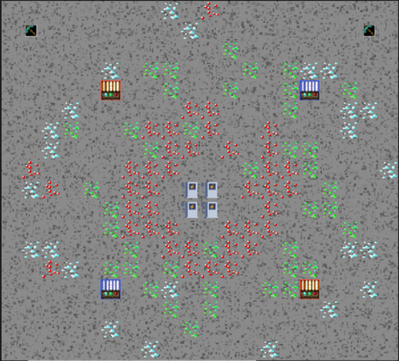

# Mine-opoly Competition Strategy
This repo will share my strategy to win the [second place](https://courses.grainger.illinois.edu/cs126/sp2022/hall-of-fame/) for mineopoly competition 3.0

## What is Mine-opoly

This is a strategy game based on exhilarating concepts like mining and economics. 
The game map looks like this:

The game is a turn based mining competition played on an NxN square set of tiles which is considered the Game Board. There are 4 types of tiles on the board:

**Empty tiles:** These tiles contain nothing

**Resource tiles:** These tiles contain a type of ore you can mine

**Market tiles:** Stepping on the market tile for your robot's color will sell all gathered resources

**Recharge tiles:** Standing on a recharge tile will give your robot more energy, as your robot's charge depletes when you move

There are two players per game, one with a red robot and one with a blue robot. Both players start in the center of the board on their lower market tile. Each turn both players will receive information about the board state. This information contains where all the resources are, where your opponent is, prices for each resource, and other such information. Each turn both players will be required to return a TurnAction. This TurnAction is an enum value which indicates what your strategy wants your player to do for the current turn. TurnActions are one of the following:

MOVE_UP, MOVE_DOWN, MOVE_LEFT, or MOVE_RIGHT all indicate that your player would like to move in that direction on this turn. Movement is relative to the bottom left tile, so MOVE_UP will move your player towards the top of your screen and MOVE_RIGHT will move your player towards the right of your screen. If your robot is out of charge (indicated by the battery icon in the GUI), then your robot will be in low-power mode. When in low-power mode, your robot only has a 25% chance to successfully move to another tile in a single turn.

MINE indicates that you would like to mine your player's current tile. How many turns it takes to finish mining a resource depends on the resource type. Diamond takes 3 turns to mine, emerald takes 2 turns to mine, and ruby only takes 1 turn to mine. When you have mined a resource enough, it will drop a gem on the tile your player is standing on.

PICK_UP_RESOURCE indicates you would like to add a resource to your inventory. If your player is standing on a tile that has a mined gem, it will add the gem to your inventory. The maximum inventory size for your player will always be 5. Attempting to pick up an item when your inventory is full will leave the item on the ground.

PICK_UP_AUTOMINER indicates you would like to add an autominer to your inventory. If your player is standing on a tile that has an autominer, it will add the autominer to your inventory. The maximum inventory size for your player will always be 5. Attempting to pick up an item when your inventory is full will leave the item on the ground.

PLACE_AUTOMINER indicates you want to place an autominer. The autominer will be placed on the tile that you are currently standing on. An autominer can not be placed on top of another autominer. However, when placed adajcently, their effects can stack.

NULL indicates that you would like to do nothing on your turn. You will need to return null for multiple turns in a row to become fully charged while standing on a recharge tile.

## What my strategy do?

My strategy is mixed by 3 parts. 

**Step 1:** To begin with, my robot will find the quickest resource to mine and go back to market as soon as possible.

After this action, hopefully I will have higher score than my opponent.

**Step 2:** I will then detect my opponent's position, and my robot will go to the nearest market for my opponent.
The core of this strategy is that my opponent can't sell its resource if I'm in the grid of my opponent's market.
To prevent my opponent detect this, I will not stand on its market until they are nearby.

How about the above case did not work?

**Step 3:** If my opponent's score is higher than me, I will take actions to mine surrounding resources that have the greatest expected value. I will continue to mine until my bag is full.
This gives me larger chance to chase up my opponent's strategy. 

After my score is higher than my opponent, I will do the step 2 again.

In most of the cases, the first two steps will work directly. That is also the reason why I win most competitions.

You can find my strategy in the directory: **src/mineopoly_three/competition/CompetitionStrategy.java**

If you are interested in this project, you can find it [here](https://courses.grainger.illinois.edu/cs126/sp2022/assignments/mineopoly/).
